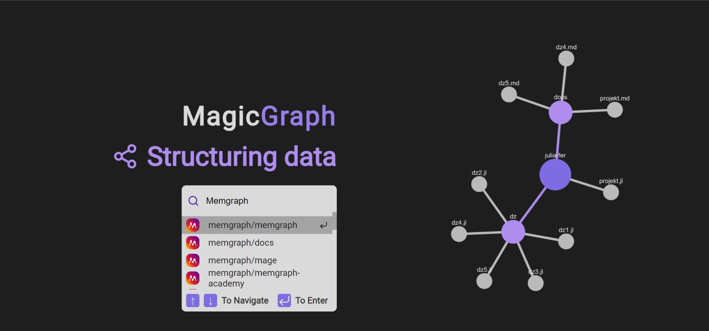
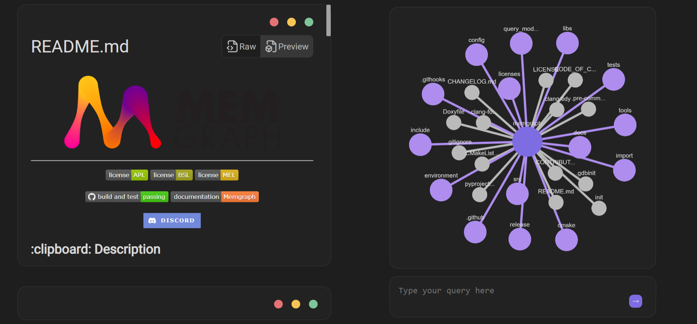
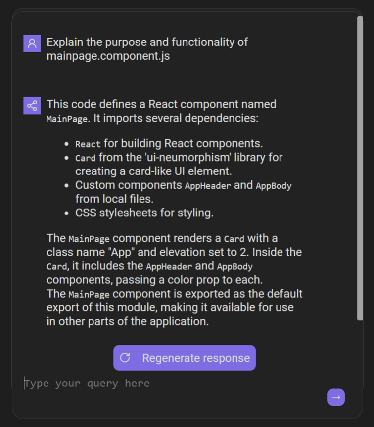
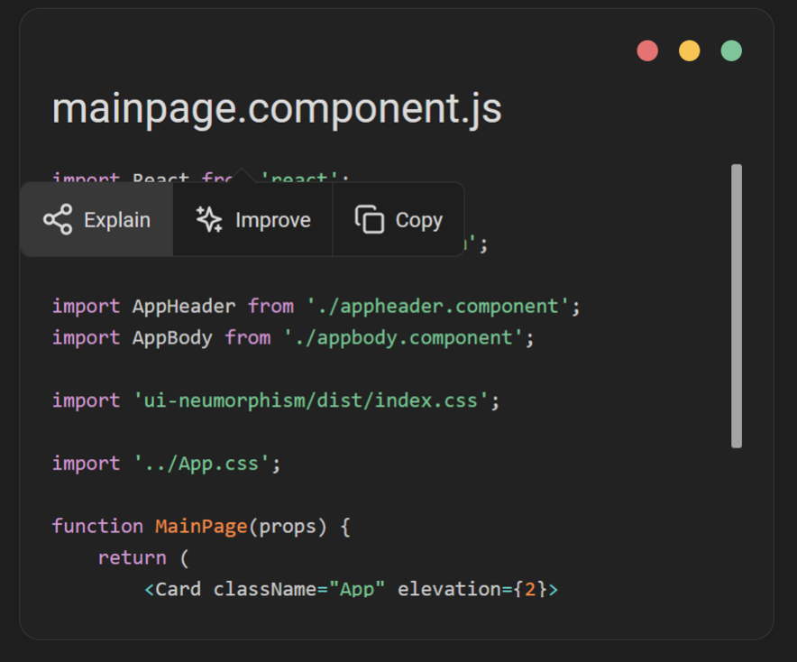

[](https://reactjs.org/)
[](https://www.typescriptlang.org/)
[](https://styled-components.com/)

[](https://github.com/)
[](https://www.docker.com/)

# RUNE - Repository Understanding, Navigation and Exploration

RUNE is a web application that integrates Large Language Model (LLM) capabilities with graph visualization to enhance developer productivity and code comprehension while using GitHub.

## Table of contents
1. [Features](#features)
2. [Disclaimer](#disclaimer)
3. [Installation](#installation)
    1. [Manual](#manual-installation)
    2. [Docker](#docker-installation)
4. [Using the app](#using-the-app)

## Features


To access the app features you need to find and select a repository you want to analyze using the search bar on the home page.
<br>
<br>

1. **Codebase review**
<p align="center">
    
</p>

- The codebase review feature in RUNE combines dynamic graph visualization, a code viewer on file node click, and brief repository data.

2. **Prompt bar for LLM queries**
<p align="center">
    
</p>

- The Prompt bar in RUNE serves as an interface to interact with LLMs, enabling you to pose natural language queries and receive detailed insights about your project structure. Due to the GitHub API limitations it can't store the content of all files and analyze it.

3. **Dynamic code analysis**
<p align="center">
    
</p>

- Dynamic code analysis in RUNE performs real-time code scrutiny, identifying issues, suggesting improvements, and fostering a proactive approach to code quality enhancement.

## Disclaimer

> **Warning**
> It is recommended that you have access to GPT-4 via the OpenAI API. GPT-3.5 will probably fail to make correct knowledge graphs from your data.
> Since we still don't have access to GPT-4 OpenAI API, although we made our account a month ago and generated >1$ in billing a week ago,
> the `init_repo`, `update_file` and `add_file` endpoints are still untested. We initialized knowledge graphs manually, through ChatGPT.
> **Here be dragons.**

You can download and run RUNE via Docker to automatically install Memgraph, frontend and the backend components, or install it manually if you prefer a more customized setup.

## Installation

1. Cloning the repository

First, you need to clone the Git repository that contains the RUNE app. If you already have the codebase, you can skip this step.

```
git clone https://github.com/memgraph/rune.git
```

Navigate into the RUNE root folder:

```
cd rune 
```

2. Generating the GitHub API Token

To access the GitHub API and get more available requests per hour, you need to create a personal access token. You can create one by following the steps below:

1.  Go to [GitHub Personal Access Tokens](https://github.com/settings/tokens) settings page.
2.  Click on "Generate new token."
3.  Provide a descriptive note for the token (e.g., "magic-graph GitHub API Token").
4.  Click "Generate token" at the bottom.

**Note**: Ensure that you save the generated token in a safe place. It will not be shown again.

3. Generating the News API token (optional for article recommendation)

To access NewsAPI and retrieve theme-related articles for your repository, you'll need to generate a [NewsAPI](https://newsapi.org/) token. Follow these steps:

1. Go to the NewsAPI website and sign in or create an account.
2. Once logged in, navigate to your account settings or dashboard.
3. Copy your API key.

**Note**: It's important to securely store the generated token. Treat it as a sensitive credential, as it provides access to the NewsAPI. Keep it confidential and avoid sharing it publicly.

4. Creating the .env file

In the root directory of your project, create a new file called `.env` (if it doesn't already exist). This file will store your environment variables, including the GitHub API token.

Open the `.env` file in a text editor and add the following lines:

```
REACT_APP_GITHUB_API_TOKEN=YOUR_GENERATED_GITHUB_TOKEN
REACT_APP_NEWS_API_TOKEN=YOUR_GENERATED_NEWSAPI_TOKEN
```

Replace `YOUR_GENERATED_GITHUB_TOKEN` and `YOUR_GENERATED_NEWSAPI_TOKEN` with the actual tokens you generated in previous steps.

5. Installing and running RUNE

    You have the option to install RUNE using Docker, which will automatically install, set up and run the Memgraph database, the backend, and frontend components, or you can manually run the project locally for a more customized setup or if you already have Memgraph up and running.

    ### Manual installation

    You will need to have [Node.js](https://nodejs.org/en/download/current) (version 14 or above) and [npm](https://docs.npmjs.com/downloading-and-installing-node-js-and-npm) (Node Package Manager) installed on your machine.

    1. Install all required dependencies: 

        ```npm install```


    2. Run the app:

        ```npm start``` 
        
        This command will compile the TypeScript code and launch the app in your default web browser. If it doesn't open automatically, you can visit `http://localhost:3000` in your browser to access the running app.

    3. Now that you have frontend up and running, you need to start the backend by following the installation steps for [BOR](https://github.com/memgraph/bor).

    ### Docker installation

    1. Starting the app

    To start RUNE make sure you have a running [Docker](https://www.docker.com/) instance and [Docker compose](https://docs.docker.com/compose/install/) installed.

    ```
    docker compose up
    ```

### Using the app

To access the running app after the installation process, you can visit `http://localhost:3000` in your browser.

